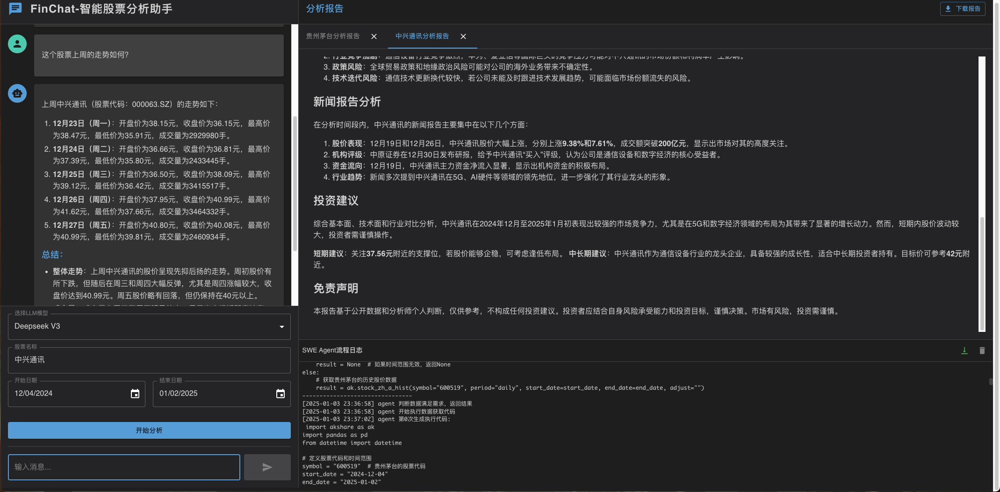

# 智能股票分析助手 (FinChat)

一个基于中国大语言模型的智能股票分析工具，能够生成股票研报并提供智能问答服务。
<div align="center">
    
</div>

## 🌟 功能特点

- 🤖 支持多种大语言模型（GLM-4-plus、Deepseek-v3），无需科学上网，都是国内大模型
- 📊 自动生成股票分析研报
- 💬 智能问答功能，可针对研报内容进行深入讨论
- 🔄 实时流式响应
- 📈 可自定义分析时间范围
- 🎯 直观的Web界面

## 🏗️ 技术架构

- 🔄 基于ReAct架构的智能Agent系统
- 📚 RAG (Retrieval-Augmented Generation) 增强的工具调用机制
- 🛠️ 自适应代码生成与执行框架
- 📊 实时数据获取与分析引擎

## 💡 创新特点

1. **突破性的Agent交互模式**
   - 创新采用Agent自主编写代码获取数据
   - 基于ReAct架构实现Agent自反思与代码优化
   - 支持运行结果反馈，实现闭环迭代改进

2. **革新性的工具调用机制**
   - 突破传统Function Call的限制
   - 创新采用RAG模式管理工具库
   - 支持千级别工具的灵活调用
   - 有效解决海量工具超出上下文限制的问题

3. **智能化的代码执行系统**
   - 支持代码自动生成与优化
   - 实时执行结果分析
   - 错误自动诊断与修正

## 🛠️ 安装说明

1. 克隆项目
```bash
git clone https://github.com/yourusername/FinChat.git
cd FinChat
```

2. 创建并激活虚拟环境（推荐）
```bash
conda create -n finchat python=3.11
conda activate finchat
```

3. 安装依赖
```bash
pip install -r requirements.txt
```

4. 配置环境变量
创建 `.env` 文件并添加以下配置：
```env
# 智谱AI配置
zhipu_api_key=your_zhipu_api_key
zhipu_base_url=your_zhipu_base_url

# Deepseek配置
deepseek_api_key=your_deepseek_api_key
deepseek_base_url=your_deepseek_base_url
```
需要自行去官网获取api，目前使用了zhipu的embedding模型，可以自行替换。
## 🚀 使用方法

### 1. 启动后端服务

```bash
# 在项目根目录下运行
uvicorn main:app --reload
# 或者用python
python main.py
```

后端服务将在 http://0.0.0.0:8000 启动

### 2. 启动前端服务

```bash
# 进入前端目录
cd frontend

# 安装前端依赖
npm install

# 启动开发服务器
npm start
```

前端服务将在 http://0.0.0.0:3000 启动

### 3. 访问应用

打开浏览器访问 http://localhost:3000 即可使用 FinChat 智能股票分析助手

<div align="center">
    
</div>

### 4. 使用说明

1. 在输入框中输入股票名称（例如：贵州茅台）
2. 系统会自动生成该股票的分析研报
3. 您可以针对研报内容提出问题，系统会基于研报内容为您解答
4. 如需分析其他股票，只需重新输入新的股票名称即可

## 📝 注意事项

- 股票名称需要输入完整的名称
- 分析时间范围不宜过长，以免影响分析速度
- 本系统生成的分析结果仅供参考，不构成投资建议
- 请确保您的API密钥配置正确且有足够的额度

## 🔒 隐私说明

- 本项目不会存储任何用户的个人信息
- API密钥仅用于与AI服务商通信，请妥善保管

## 📄 许可证

MIT License

## 🤝 贡献指南

欢迎提交 Issue 和 Pull Request 来帮助改进项目。

<a href="https://github.com/XingYu-Zhong/FinChat/graphs/contributors">
  
</a>

## 📞 联系方式

如有问题或建议，请通过 Issue 与我们联系。

## 🌟Star History
<picture>
  <source
    media="(prefers-color-scheme: dark)"
    srcset="
      https://api.star-history.com/svg?repos=XingYu-Zhong/FinChat&type=Date&theme=dark
    "
  />
  <source
    media="(prefers-color-scheme: light)"
    srcset="
      https://api.star-history.com/svg?repos=XingYu-Zhong/FinChat&type=Date
    "
  />
  
</picture>